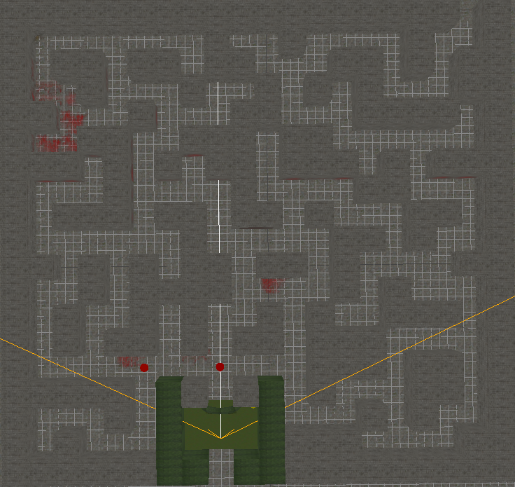

# _VR Maze_

#### By _**Sean VanLeeuwen**_

## Description

_A Virtual Reality Maze, which will let you move through the maze. Stretch Goals: Maze Timer, Mini Games._

## Specs

## Setup/Installation Requirements

_In the terminal, type 'git clone https://github.com/ShonBurgundy/capstone-vr.git'._

First make sure you have Node installed.

On Mac OS X, it's recommended to use [Homebrew](http://brew.sh/) to install Node + [npm](https://www.npmjs.com):

    brew install node

To install the Node dependencies:

    npm install

### Local Development

To serve the site from a simple Node development server:

    npm start

Then launch the site from your favourite browser:

[__http://localhost:3000/__](http://localhost:3000/)

If you wish to serve the site from a different port:

    PORT=8000 npm start

### Deploy to Github Pages

Make sure you have committed all changes to master branch. Then run:

    npm run deploy

## Known Bugs

* _Timer does not display on screen_
* _Click to replay not working yet_
* _Player can fall off map if they reach the end_

## Support and contact details

_Sean VanLeeuwen's email:_
__seanbeloussow@yahoo.com

## Technologies Used

* _A-Frame_
* _HTML_
* _CSS_
* _Javascript_
* _Git_

## Screenshots

### Links
[A-Frame](https://aframe.io/)

### License

**The MIT license**

Copyright (c) 2020 Sean VanLeeuwen